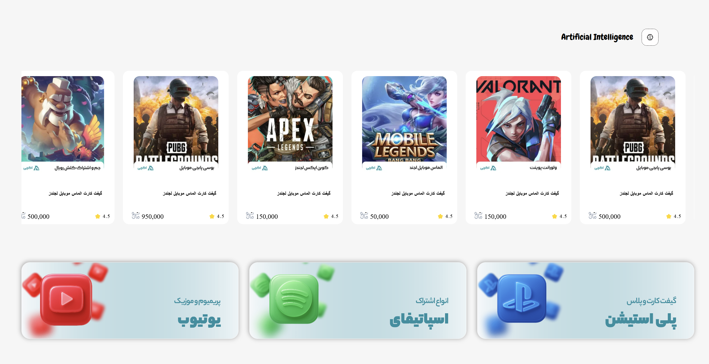
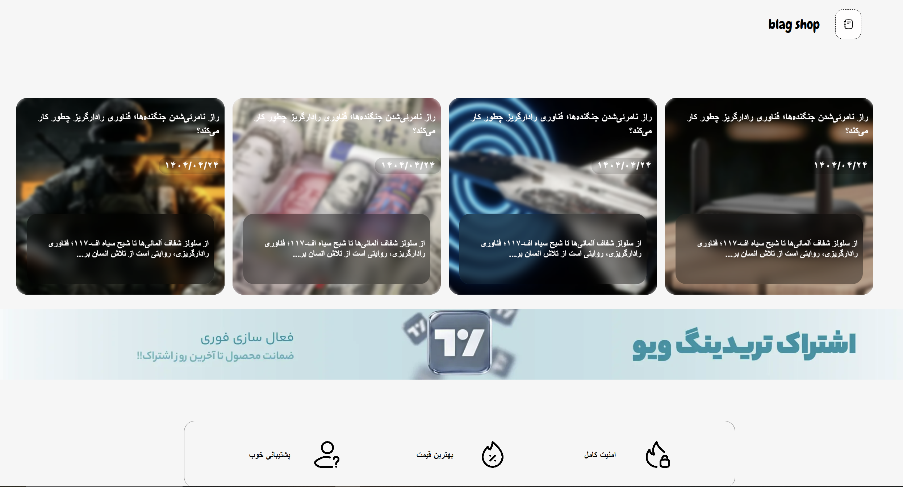

#  GameShop | CSS Animation Showcase

A premium, high-fidelity visual exploration of a modern Video Game Store landing page. This project was built primarily as an advanced practice ground for intricate CSS Animations, custom micro-interactions, and deep structural layouts using CSS Grid and Flexbox without relying on heavy JavaScript libraries.

---

## 🔗 Live Demo

Experience the animations and design live in your browser:
🚀 [Launch GameShop Live Preview](https://poria-dev.github.io/gameShop/)

---

## ⚡ Core Focus & Features

* 🎬 Cinematic CSS Animations: Powered entirely by CSS @keyframes and transitions. Includes immersive hover effects, glowing interactive states, dynamic ambient backgrounds, and fluid element entrances.
* 📐 Modern Structural Layouts: Built utilizing a hybrid architecture of CSS Grid (for complex bento-grid game showcases and structural alignment) and Flexbox (for alignment-critical navigation bars, cards, and UI components).
* 🎮 Cyberpunk & Dark Aesthetics: Designed with a striking, dark-mode gaming color palette featuring neon accents, subtle drop-shadow glows, and rich visual hierarchy.

---

## 📸 Interface Previews

Explore the structural composition and visual styling through the project screenshots:

<table width="100%">
  <tr>
    <td width="50%" align="center">
      
       <b>Preview 01 - Hero & Featured Grid</b>
    </td>
    <td width="50%" align="center">
      
       <b>Preview 02 - Animations & Storefront</b>
    </td>
  </tr>
</table>

> [!IMPORTANT]
> Note on Image Formats: If your image files inside the ./screen/ directory have a different extension (like .jpg instead of .png), remember to update the shat1.png and shat2.png extensions in the table code above.

---

## 🛠️ Built With

  
  &nbsp;
  

* HTML5 – Structured Semantic Elements
* CSS3 – Grid Layout, Flexbox Alignment, and Custom Keyframe Animations

---

## ⚠️ Responsive Status

> [!NOTE]
> This repository represents a Conceptual/Experimental UI Study designed primarily to push the limits of desktop-class CSS transitions and layout performance. It is not fully responsive and is optimized specifically for standard desktop monitors.

---

## ⚙️ Local Installation & Setup

To explore the source code locally on your machine, follow these steps:

1. Clone the repository:
`bash
   git clone [https://github.com/Pooria-dev/gameShop.git](https://github.com/Pooria-dev/gameShop.git)
